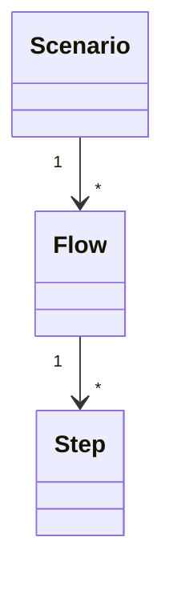

# k6-template

## 構成

- src
    - steps
    - flows
    - scenarios
        - smoke
        - performance
        - stability

### step

リクエストとレスポンス検証をまとめたモジュール。
この単位でシナリオを構築する。

### flow

stepを組み合わせたテストの一連の流れを表現したモジュール。

### scenario

シナリオのフローとその実行設定を組み合わせたモジュール。k6のシナリオ。



## build/run

```shell
$ yarn webpack
$ k6 ./dist/scenarios/scenario-test-1.js
```
